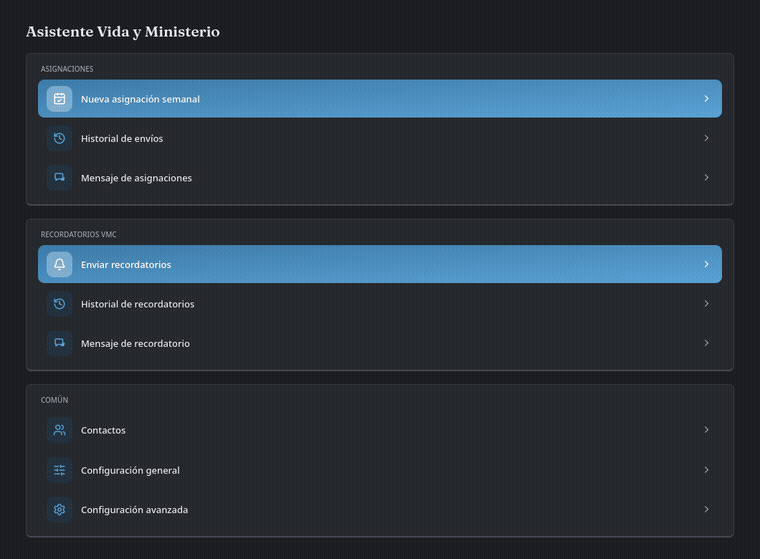
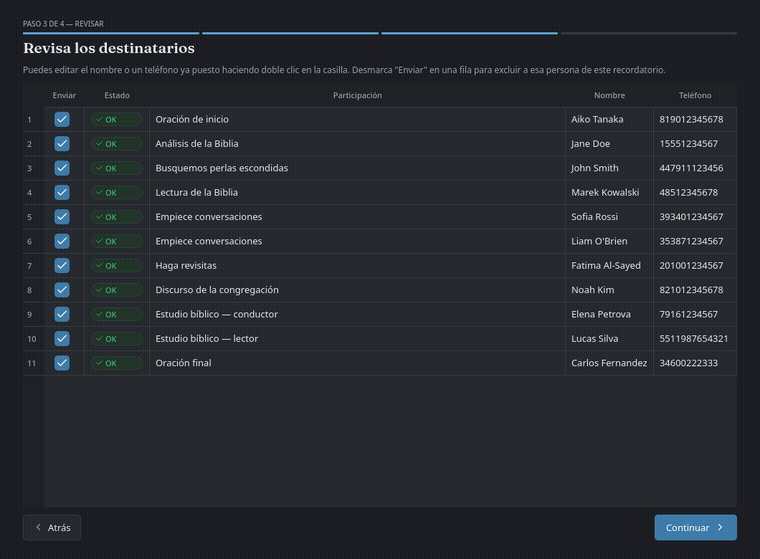

<p align="center">
  
</p>

<h1 align="center">Life & Ministry Assistant 🗓️</h1>

<p align="center">
  <strong>Convierte el VMC en papeletas de asignación y avisos de WhatsApp listos para enviar — sin Excel, sin macros, sin BulkPDF/Wine.</strong>
</p>

<p align="center">
  <a href="https://github.com/ncfer/life-ministry-assistant/releases/latest"></a>
  <a href="https://github.com/ncfer/life-ministry-assistant/actions/workflows/build.yml"></a>
  <a href="LICENSE"></a>
  
</p>

<p align="center">
  <a href="https://github.com/ncfer/life-ministry-assistant/releases/latest">⬇ Descargar</a> ·
  <a href="https://github.com/ncfer/life-ministry-assistant/issues/new?labels=bug">🐛 Reportar un error</a> ·
  <a href="https://github.com/ncfer/life-ministry-assistant/issues/new?labels=enhancement">✨ Pedir una función</a> ·
  <a href="README.md">🌐 English</a>
</p>

---

<p align="center">
  
</p>

Tiene dos formas de usarse: con **ventanas** (pensada para cualquiera,
sin necesidad de saber de ordenadores) o desde la **terminal** (más
rápida si ya la manejas). Ambas hacen lo mismo por dentro.

Un par de pantallas más que no salen en el recorrido de arriba:

<table>
  <tr>
    <td width="50%">
      <br>
      <sub><strong>Contactos.</strong> Emparejados con cada asignación en automático, con sugerencias por parecido.</sub>
    </td>
    <td width="50%">
      <br>
      <sub><strong>Editor de mensaje.</strong> Vista previa en vivo de exactamente lo que le llegará al destinatario.</sub>
    </td>
  </tr>
</table>

---

## 🔄 Cómo funciona

<table>
  <tr>
    <td align="center" width="33%">
      <h2>📄 → 🗓️</h2>
      <strong>1. Traer el VMC</strong><br>
      <sub>PDF local, un tablón de Padlet, o un enlace de Google Drive</sub>
    </td>
    <td align="center" width="33%">
      <h2>🔍 → ✅</h2>
      <strong>2. Revisar y emparejar</strong><br>
      <sub>Nombres emparejados con teléfonos, corriges lo que falte</sub>
    </td>
    <td align="center" width="33%">
      <h2>💬 → 📤</h2>
      <strong>3. Enviar por WhatsApp</strong><br>
      <sub>Ventana real de Chrome, un clic de confirmación, nada se envía por sorpresa</sub>
    </td>
  </tr>
</table>

---

## ✨ Funcionalidades

<table>
  <tr>
    <td width="50%" valign="top">
      <strong>📋 Papeletas de asignación</strong><br>
      Genera el PDF/JPG de la papeleta S-89 oficial para cada
      asignación que tiene una, directamente desde el PDF del
      programa. Sin copiar y pegar a mano.
    </td>
    <td width="50%" valign="top">
      <strong>🔔 Recordatorios de calendario</strong><br>
      Adjunta un archivo <code>.ics</code>, un link de Google Calendar,
      o ambos — queda directo en el calendario del teléfono.
    </td>
  </tr>
  <tr>
    <td width="50%" valign="top">
      <strong>📣 Recordatorios de reunión, más allá de las papeletas</strong><br>
      Un flujo aparte que avisa a <em>todo el mundo</em> que tiene una
      parte esa semana (lectura, discursos, oraciones…), enviando la
      foto del programa con un texto corto y personalizado para cada uno.
    </td>
    <td width="50%" valign="top">
      <strong>🧠 Búsqueda inteligente de contactos</strong><br>
      Busca el teléfono de cada persona automáticamente; si no
      encuentra una coincidencia exacta sugiere el nombre más parecido
      en vez de fallar en silencio.
    </td>
  </tr>
  <tr>
    <td width="50%" valign="top">
      <strong>✏️ Plantillas editables, vista previa en vivo</strong><br>
      Cambia el texto sin tocar código. Huecos como <code>{nombre}</code>
      o <code>{fecha}</code> se rellenan solos, y ves exactamente lo
      que se envía antes de enviarlo.
    </td>
    <td width="50%" valign="top">
      <strong>🕓 Historial de envíos</strong><br>
      Cada tanda que mandas (asignaciones y recordatorios) queda
      registrada, para revisar quién recibió qué y cuándo.
    </td>
  </tr>
  <tr>
    <td width="50%" valign="top">
      <strong>🖥️ Dos formas de usarla</strong><br>
      Modo ventanas completo para cualquiera, o modo terminal/CLI
      programable para uso avanzado o por lotes.
    </td>
    <td width="50%" valign="top">
      <strong>🌗 Idioma y tema cambiables</strong><br>
      Interfaz bilingüe (español/inglés) y tema claro/oscuro, ambos
      cambiables desde Ajustes en cualquier momento.
    </td>
  </tr>
  <tr>
    <td width="50%" valign="top" colspan="2">
      <strong>🌍 Funciona en cualquier sitio</strong><br>
      Linux, Windows y Mac, como ejecutable de un solo archivo o
      directamente desde el código.
    </td>
  </tr>
</table>

<p align="center">
  
</p>
<p align="center"><sub>La foto del programa de arriba es un ejemplo inventado, no una página real del programa — ver la nota de abajo.</sub></p>

> [!NOTE]
> Este proyecto no está afiliado ni respaldado por los Testigos de
> Jehová, la Watch Tower Bible and Tract Society, WhatsApp, ni Meta
> Platforms, Inc. Es una herramienta independiente que automatiza una
> sesión real de navegador sobre WhatsApp Web — como usarlo a mano,
> solo que con guion — y está pensada para ayudar con el flujo de
> trabajo de la papeleta S-89.

## 📦 Instalación (solo la primera vez)

No hace falta terminal ni saber de ordenadores: descomprime la carpeta
donde quieras, y abre la carpeta `launcher` para encontrar el lanzador
de tu sistema — salvo en Windows si hay un `.exe` ya compilado, que va
suelto en la carpeta principal (ver más abajo):

- **Windows:** si existe `LifeMinistryAssistant.exe` en la carpeta
  principal, úsalo — no necesita tener Python instalado (va todo
  incluido), pesa unos 150-200 MB y arranca directo. Si no existe, entra
  en `launcher/` y usa `launch_gui.bat` en su lugar (hace lo mismo, pero
  necesita Python instalado y se ve como una ventana de consola). Puedes
  crear un acceso directo en el Escritorio con botón derecho → "Crear
  acceso directo" sobre cualquiera de los dos.
  (`LifeMinistryAssistant.exe` no viene ya compilado en el zip por su tamaño — quien
  lo reparte puede generarlo una vez ejecutando `dev/build_exe.bat` en un
  Windows real, ver el comentario dentro de ese archivo. `LifeMinistryAssistant.exe`
  no descarga ningún navegador por su cuenta: si al enviar por WhatsApp no
  encuentra Chrome, Edge ni Chromium instalado, avisa con instrucciones
  claras de qué instalar. `launch_gui.bat` sí sigue ofreciendo descargar un
  navegador propio automáticamente la primera vez si hace falta, como
  hacía hasta ahora.)

  > [!NOTE]
  > `LifeMinistryAssistant.exe` todavía no está firmado digitalmente, así
  > que Windows SmartScreen puede avisar de "Windows protegió tu PC" la
  > primera vez que lo abras. Pulsa **Más información** y luego
  > **Ejecutar de todas formas**. Hay una solicitud en curso de
  > certificado gratuito de firma de código con
  > [SignPath Foundation](https://signpath.org/) que eliminará este aviso
  > una vez aprobada.
- **Mac:** entra en `launcher/` y haz doble clic en `launch_gui.command`
  (no uses `launch_gui.sh` para el doble clic, Mac lo abriría como texto
  en vez de ejecutarlo). La primera vez puede que Mac avise de que es de
  "un desarrollador no identificado" — haz clic derecho sobre el archivo
  → **Abrir**, y confirma en el aviso (solo hace falta esa vez).
- **Linux:** entra en `launcher/` y haz doble clic en `launch_gui.sh` (si
  el gestor de archivos pregunta qué hacer, elige "Ejecutar" o "Ejecutar
  en terminal"), o desde una terminal: `./launcher/launch_gui.sh`.

La primera vez que lo abras se instala todo solo — entorno de Python,
todas las dependencias, y el navegador para WhatsApp si hace falta —,
así que tarda unos minutos y necesita conexión a internet; deja la
ventana abierta hasta que termine. Las siguientes veces abre al momento.

Solo necesitas tener **Python 3** instalado de antemano (si no lo
tienes, el propio lanzador te avisa con el enlace de descarga —
[python.org/downloads](https://www.python.org/downloads/); en Windows,
marca la casilla "Add python.exe to PATH" durante su instalación) y,
si quieres el envío por WhatsApp con tu Chrome de siempre en vez de uno
descargado aparte, **Google Chrome** ya instalado — si no lo tienes, el
lanzador descarga su propio navegador automáticamente, no hace falta
hacer nada.

## 🖱️ Modo ventanas (recomendado)

> [!IMPORTANT]
> El PDF de la papeleta S-89 no viene incluido (es un formulario propio
> de la Watch Tower) — pídeselo a quien te ha pasado esta carpeta, o usa
> el que ya tenga tu congregación.

La primera vez pedirá configurar las rutas (dónde está esa plantilla,
dónde guardar lo que se genera, etc.) — se hace una sola vez desde la
propia ventana, sin tocar ningún archivo.

Luego, cada semana solo hace falta:
1. **Nueva asignación semanal** → elegir el PDF del VMC.
2. Marcar la semana (o semanas) que se quieren generar.
3. Revisar la tabla: si a alguien no se le ha encontrado el teléfono,
   sale resaltado en rojo con un botón de sugerencia si hay un nombre
   parecido en la lista, o se puede escribir a mano.
4. Ver la vista previa de cada papeleta antes de seguir.
5. Elegir si se manda `.ics`, link de Google Calendar, o ambos, marcar
   "he revisado" y pulsar ENVIAR.

**Enviar recordatorios** funciona igual pero cubre a todo el que tiene
una parte esa semana, no solo los roles con papeleta oficial: eliges el
VMC, revisas la tabla (misma búsqueda de teléfono y vista previa), y se
envía la foto del programa de esa semana con un texto personalizado a
cada participante — sin paso de `.ics`/calendario aquí, ya que es un
aviso rápido y no una asignación formal.

Desde la pantalla de inicio también se editan los contactos, los
mensajes de asignación y de recordatorio, y la configuración avanzada
(idioma, tema, tiempos de WhatsApp entre envíos) — todo con
formularios, sin archivos ni comandos.

## ⌨️ Modo terminal (avanzado)

### 1. Editar la lista de contactos

Los contactos viven en `contacts.csv`, un archivo de texto sencillo con
dos columnas: `name` y `phone`. Dos formas de editarlo, elige la que
te resulte más cómoda:

- **Con una hoja de cálculo:** abre `contacts.csv` con LibreOffice Calc,
  Excel o Google Sheets, edítalo como una tabla normal, y guarda (mantén
  el formato CSV al guardar).
- **Con el menú de terminal**, sin tocar ningún archivo a mano:
  ```bash
  python -m assistant.edit_contacts
  ```
  Te deja listar, buscar, añadir/actualizar y borrar contactos con un
  menú numerado.

El teléfono va con el código de país y sin espacios, `+` ni otros
símbolos — por ejemplo, un número de EE.UU. sería `15551234567`, uno
de Reino Unido `447911123456`.

Si vienes del Excel antiguo y quieres traerte toda la lista de golpe:
```bash
python -m assistant.migrate_contacts "PLANTILLA ASIGNACIONES.xlsm" contacts.csv
```

### 2. Editar el mensaje de WhatsApp

El texto que se envía está en `message.txt`, en texto normal, sin nada
de código. Puedes cambiarlo como quieras, en el idioma que prefieras;
los huecos entre llaves se rellenan automáticamente con los datos de
cada asignación:

| Hueco | Se rellena con |
|---|---|
| `{nombre}` | Nombre completo de la persona |
| `{nombre_pila}` | Solo el nombre de pila |
| `{ayudante}` | Nombre del ayudante (vacío si no tiene) |
| `{fecha}` | Fecha de la reunión |
| `{numero}` | Número de la intervención |
| `{tipo}` | Tipo de intervención (ej. "Lectura de la Biblia") |
| `{link}` | Link de Google Calendar (si eliges enviarlo) |

(Los equivalentes en inglés `{name}`, `{first_name}`, `{helper}`,
`{date}`, `{number}`, `{type}` también funcionan — escribe tu plantilla
en el idioma que prefieras, ambos apuntan a los mismos datos.)

Ejemplo por defecto:
```
Buenas {nombre}, te recuerdo que tienes una asignación programada para el próximo día {fecha}: {numero}. {tipo}.
```

### 3. Generar las papeletas

(Cada flag tiene también un alias en inglés — `--workbook`,
`--template`, `--contacts`, `--message`, `--month`, `--weeks`,
`--send`, `--reminder` — mismo comportamiento, usa el que prefieras.)

```bash
python -m assistant.cli \
  --vmc "VMC 09-10 2026.pdf" \
  --plantilla "PLANTILLA ASIGNACIONES.pdf" \
  --mes 2026-09
```

Esto genera un PDF, un JPG y un `.ics` por persona dentro de `output/`, y
muestra en pantalla un resumen con el teléfono encontrado de cada uno (o
un aviso si no se ha encontrado, para revisarlo a mano). No envía nada
todavía.

Para una sola semana en vez de un mes entero:
```bash
--semanas 2026-09-09,2026-09-16
```

### 4. Enviar por WhatsApp

Añade `--enviar` al mismo comando. Antes de mandar nada:
1. Te pregunta si quieres enviar el recordatorio como archivo `.ics`,
   como link de Google Calendar, o ambos (o pásalo directo con
   `--recordatorio ics|gcal|ambos`).
2. Te enseña el resumen y pide que confirmes escribiendo `s`.

La primera vez se abrirá una ventana de Chrome con un código QR — lo
escaneas con el móvil (WhatsApp > Ajustes > Dispositivos vinculados) y ya
no hace falta repetirlo en las siguientes ejecuciones (queda la sesión
guardada en tu propio ordenador).

> [!NOTE]
> **¿Es seguro?** No hay una garantía absoluta, pero el riesgo es bajo: se
> manda a contactos conocidos (no desconocidos ni listas grandes), y se
> hace controlando un navegador de verdad sobre WhatsApp Web — como si lo
> hicieras tú a mano, solo que automático — en vez de usar alguna librería
> no oficial que hable directo con WhatsApp. Se respetan además pausas
> entre mensajes para no parecer un envío masivo.

## 🗂️ Estructura de salida

```
output/
└── 2026-09/
    ├── 2026-09-09 - 3 - Jane Doe.pdf
    ├── 2026-09-09 - 3 - Jane Doe.jpg
    ├── 2026-09-09 - 3 - Jane Doe.ics
    └── ...
```

## 🤝 Repartir esta app a otra persona o congregación

Ejecuta `./dev/package.sh` (desde una terminal, en tu copia de trabajo) y
genera `dist/life-ministry-assistant-AAAAMMDD.zip`: una copia limpia del
proyecto, sin tus contactos, tu historial de envíos, tu configuración,
los VMC que hayas usado ni tus mensajes personalizados — solo el código
y un `contacts.csv` de ejemplo. Compártelo tal cual; quien lo reciba solo tiene que
descomprimirlo y seguir la sección "Instalación" de arriba. Si más
adelante cambias algo del código, vuelve a ejecutar `./dev/package.sh`
para generar un zip actualizado — no hace falta ningún paso extra por
sistema operativo, es la misma carpeta para Windows, Mac y Linux.

---

<p align="center"><sub>Con licencia MIT — ver <a href="LICENSE">LICENSE</a>.</sub></p>
