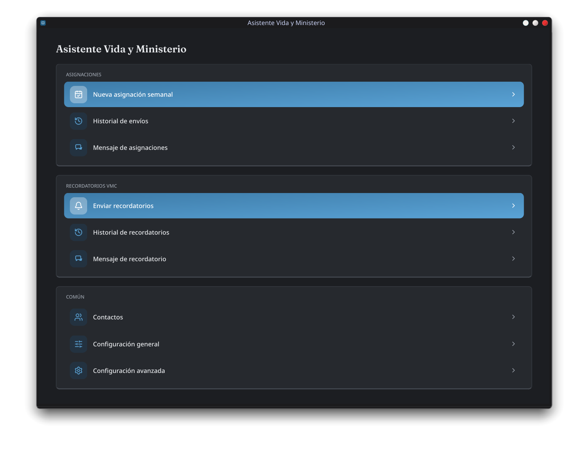
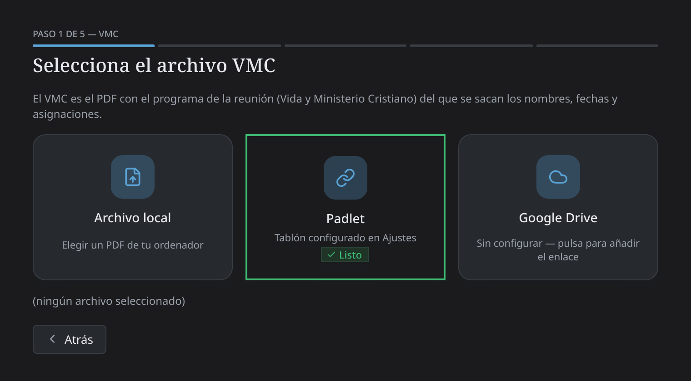
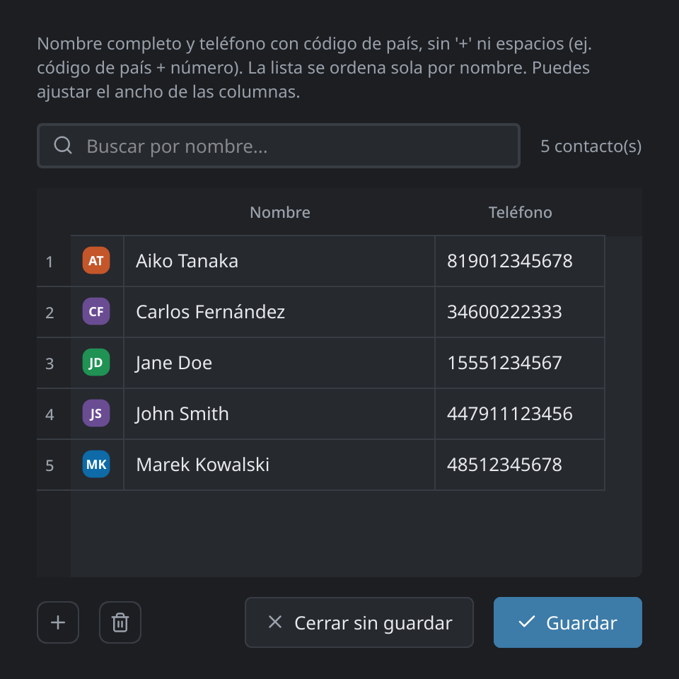
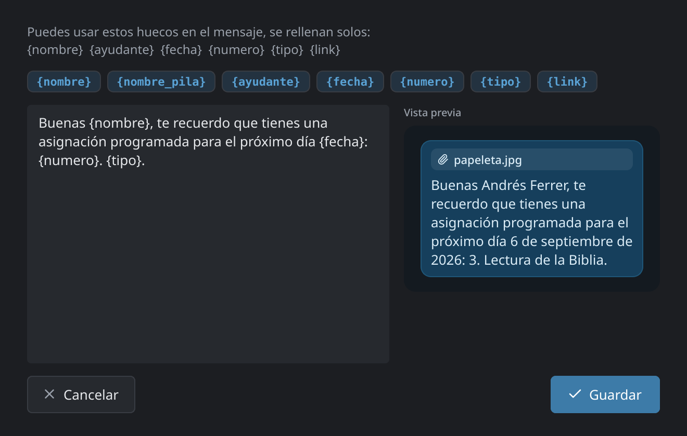

<p align="center">
  
</p>

<p align="center"><i><a href="README.md">Read in English →</a></i></p>

Genera las papeletas de asignación (PDF/JPG) y los recordatorios de
calendario a partir del VMC, y los envía por WhatsApp — sin depender de
Excel, macros ni de BulkPDF/Wine. Funciona en Linux, Windows y Mac.

Tiene dos formas de usarse: con **ventanas** (pensada para cualquiera,
sin necesidad de saber de ordenadores) o desde la **terminal** (más
rápida si ya la manejas). Ambas hacen lo mismo por dentro.

<p align="center">
  
  
</p>
<p align="center">
  
  
</p>

## Funcionalidades

- **Papeletas de asignación** — genera el PDF/JPG de la papeleta S-89
  oficial para cada asignación que tiene una, directamente a partir del
  PDF del programa de la reunión Vida y Ministerio. Sin copiar y pegar
  a mano.
- **Recordatorios de calendario** — adjunta un archivo `.ics`, un link
  de Google Calendar, o ambos, a cada asignación, para que quede
  directamente en el calendario del teléfono de la persona.
- **Recordatorios de reunión, más allá de las papeletas** — un flujo
  aparte que avisa a *todo el mundo* que tiene una parte esa semana
  (lectura de la Biblia, discursos de Nuestra vida cristiana,
  oraciones, Tesoros/Perlas escondidas…, no solo los roles con papeleta
  S-89 oficial). Envía la foto del programa de esa semana con un texto
  corto y personalizado para cada participante.
- **Tres formas de traer el VMC**: elegir un PDF local, sacarlo
  directamente de un tablón de Padlet (si tu congregación lo publica
  ahí), o de un enlace de Google Drive — sin descargar nada a mano una
  vez configurado.
- **Envío por WhatsApp automatizado, pero con cuidado** — controla una
  ventana real de Chrome/Chromium sobre WhatsApp Web (no una librería
  no oficial haciéndose pasar por WhatsApp), con pausas entre envíos y
  un paso de confirmación manual antes de que salga nada.
- **Búsqueda inteligente de contactos** — busca el teléfono de cada
  persona automáticamente; si no encuentra una coincidencia exacta
  sugiere el nombre más parecido en vez de fallar en silencio o no
  enviar nada.
- **Plantillas de mensaje editables con vista previa en vivo** — cambia
  el texto sin tocar código. Huecos como `{nombre}` o `{fecha}` se
  rellenan solos, y ves exactamente lo que le va a llegar al
  destinatario antes de que se envíe nada.
- **Historial de envíos** — cada tanda que mandas (asignaciones y
  recordatorios) queda registrada, para poder revisar quién recibió
  qué y cuándo.
- **Dos formas de usarla** — modo ventanas completo para cualquiera, o
  modo terminal/CLI programable para uso avanzado o por lotes.
- **Interfaz bilingüe** (español/inglés) y **tema claro/oscuro**,
  ambos cambiables desde Ajustes en cualquier momento.
- **Funciona en cualquier sitio** — Linux, Windows y Mac, como
  ejecutable de un solo archivo o directamente desde el código.

## Instalación (solo la primera vez)

No hace falta terminal ni saber de ordenadores: descomprime la carpeta
donde quieras y haz doble clic en el lanzador de tu sistema:

- **Windows:** si existe `LifeMinistryAssistant.exe` en esta carpeta, úsalo — no
  necesita tener Python instalado (va todo incluido), pesa unos 150-200 MB
  y arranca directo. Si no existe, usa `launch_gui.bat` en su lugar (hace lo
  mismo, pero necesita Python instalado y se ve como una ventana de
  consola). Puedes crear un acceso directo en el Escritorio con botón
  derecho → "Crear acceso directo" sobre cualquiera de los dos.
  (`LifeMinistryAssistant.exe` no viene ya compilado en el zip por su tamaño — quien
  lo reparte puede generarlo una vez ejecutando `build_exe.bat` en un
  Windows real, ver el comentario dentro de ese archivo. `LifeMinistryAssistant.exe`
  no descarga ningún navegador por su cuenta: si al enviar por WhatsApp no
  encuentra Chrome, Edge ni Chromium instalado, avisa con instrucciones
  claras de qué instalar. `launch_gui.bat` sí sigue ofreciendo descargar un
  navegador propio automáticamente la primera vez si hace falta, como
  hacía hasta ahora.)
- **Mac:** `launch_gui.command` (no uses `launch_gui.sh` para el doble
  clic, Mac lo abriría como texto en vez de ejecutarlo). La primera vez
  puede que Mac avise de que es de "un desarrollador no identificado" —
  haz clic derecho sobre el archivo → **Abrir**, y confirma en el aviso
  (solo hace falta esa vez).
- **Linux:** doble clic en `launch_gui.sh` (si el gestor de archivos
  pregunta qué hacer, elige "Ejecutar" o "Ejecutar en terminal"), o desde
  una terminal: `./launch_gui.sh`.

La primera vez que lo abras se instala todo solo — entorno de Python,
todas las dependencias, y el navegador para WhatsApp si hace falta —,
así que tarda unos minutos y necesita conexión a internet; deja la
ventana abierta hasta que termine. Las siguientes veces abre al momento.

Solo necesitas tener **Python 3** instalado de antemano (si no lo
tienes, el propio lanzador te avisa con el enlace de descarga —
[python.org/downloads](https://www.python.org/downloads/); en Windows,
marca la casilla "Add python.exe to PATH" durante su instalación) y,
si quieres el envío por WhatsApp con tu Chrome de siempre en vez de uno
descargado aparte, **Google Chrome** ya instalado — si no lo tienes, el
lanzador descarga su propio navegador automáticamente, no hace falta
hacer nada.

## Modo ventanas (recomendado)

La primera vez pedirá configurar las rutas (dónde está el PDF de la S-89,
dónde guardar lo que se genera, etc.) — se hace una sola vez desde la
propia ventana, sin tocar ningún archivo. El PDF de la S-89
(`PLANTILLA ASIGNACIONES.pdf`) no viene incluido — pídeselo a
quien te ha pasado esta carpeta, o usa el que ya tenga tu congregación.

Luego, cada semana solo hace falta:
1. **Nueva asignación semanal** → elegir el PDF del VMC.
2. Marcar la semana (o semanas) que se quieren generar.
3. Revisar la tabla: si a alguien no se le ha encontrado el teléfono,
   sale resaltado en rojo con un botón de sugerencia si hay un nombre
   parecido en la lista, o se puede escribir a mano.
4. Ver la vista previa de cada papeleta antes de seguir.
5. Elegir si se manda `.ics`, link de Google Calendar, o ambos, marcar
   "he revisado" y pulsar ENVIAR.

**Enviar recordatorios** funciona igual pero cubre a todo el que tiene
una parte esa semana, no solo los roles con papeleta oficial: eliges el
VMC, revisas la tabla (misma búsqueda de teléfono y vista previa), y se
envía la foto del programa de esa semana con un texto personalizado a
cada participante — sin paso de `.ics`/calendario aquí, ya que es un
aviso rápido y no una asignación formal.

Desde la pantalla de inicio también se editan los contactos, los
mensajes de asignación y de recordatorio, y la configuración avanzada
(idioma, tema, tiempos de WhatsApp entre envíos) — todo con
formularios, sin archivos ni comandos.

## Modo terminal (avanzado)

### 1. Editar la lista de contactos

Los contactos viven en `contacts.csv`, un archivo de texto sencillo con
dos columnas: `name` y `phone`. Dos formas de editarlo, elige la que
te resulte más cómoda:

- **Con una hoja de cálculo:** abre `contacts.csv` con LibreOffice Calc,
  Excel o Google Sheets, edítalo como una tabla normal, y guarda (mantén
  el formato CSV al guardar).
- **Con el menú de terminal**, sin tocar ningún archivo a mano:
  ```bash
  python -m assistant.edit_contacts
  ```
  Te deja listar, buscar, añadir/actualizar y borrar contactos con un
  menú numerado.

El teléfono va con el código de país y sin espacios, `+` ni otros
símbolos — por ejemplo, un número de EE.UU. sería `15551234567`, uno
de Reino Unido `447911123456`.

Si vienes del Excel antiguo y quieres traerte toda la lista de golpe:
```bash
python -m assistant.migrate_contacts "PLANTILLA ASIGNACIONES.xlsm" contacts.csv
```

### 2. Editar el mensaje de WhatsApp

El texto que se envía está en `message.txt`, en texto normal, sin nada
de código. Puedes cambiarlo como quieras, en el idioma que prefieras;
los huecos entre llaves se rellenan automáticamente con los datos de
cada asignación:

| Hueco | Se rellena con |
|---|---|
| `{nombre}` | Nombre completo de la persona |
| `{nombre_pila}` | Solo el nombre de pila |
| `{ayudante}` | Nombre del ayudante (vacío si no tiene) |
| `{fecha}` | Fecha de la reunión |
| `{numero}` | Número de la intervención |
| `{tipo}` | Tipo de intervención (ej. "Lectura de la Biblia") |
| `{link}` | Link de Google Calendar (si eliges enviarlo) |

(Los equivalentes en inglés `{name}`, `{first_name}`, `{helper}`,
`{date}`, `{number}`, `{type}` también funcionan — escribe tu plantilla
en el idioma que prefieras, ambos apuntan a los mismos datos.)

Ejemplo por defecto:
```
Buenas {nombre}, te recuerdo que tienes una asignación programada para el próximo día {fecha}: {numero}. {tipo}.
```

### 3. Generar las papeletas

(Cada flag tiene también un alias en inglés — `--workbook`,
`--template`, `--contacts`, `--message`, `--month`, `--weeks`,
`--send`, `--reminder` — mismo comportamiento, usa el que prefieras.)

```bash
python -m assistant.cli \
  --vmc "VMC 09-10 2026.pdf" \
  --plantilla "PLANTILLA ASIGNACIONES.pdf" \
  --mes 2026-09
```

Esto genera un PDF, un JPG y un `.ics` por persona dentro de `output/`, y
muestra en pantalla un resumen con el teléfono encontrado de cada uno (o
un aviso si no se ha encontrado, para revisarlo a mano). No envía nada
todavía.

Para una sola semana en vez de un mes entero:
```bash
--semanas 2026-09-09,2026-09-16
```

### 4. Enviar por WhatsApp

Añade `--enviar` al mismo comando. Antes de mandar nada:
1. Te pregunta si quieres enviar el recordatorio como archivo `.ics`,
   como link de Google Calendar, o ambos (o pásalo directo con
   `--recordatorio ics|gcal|ambos`).
2. Te enseña el resumen y pide que confirmes escribiendo `s`.

La primera vez se abrirá una ventana de Chrome con un código QR — lo
escaneas con el móvil (WhatsApp > Ajustes > Dispositivos vinculados) y ya
no hace falta repetirlo en las siguientes ejecuciones (queda la sesión
guardada en tu propio ordenador).

**¿Es seguro?** No hay una garantía absoluta, pero el riesgo es bajo: se
manda a contactos conocidos (no desconocidos ni listas grandes), y se
hace controlando un navegador de verdad sobre WhatsApp Web — como si lo
hicieras tú a mano, solo que automático — en vez de usar alguna librería
no oficial que hable directo con WhatsApp. Se respetan además pausas
entre mensajes para no parecer un envío masivo.

## Estructura de salida

```
output/
└── 2026-09/
    ├── 2026-09-09 - 3 - Jane Doe.pdf
    ├── 2026-09-09 - 3 - Jane Doe.jpg
    ├── 2026-09-09 - 3 - Jane Doe.ics
    └── ...
```

## Repartir esta app a otra persona o congregación

Ejecuta `./package.sh` (desde una terminal, en tu copia de trabajo) y
genera `dist/life-ministry-assistant-AAAAMMDD.zip`: una copia limpia del
proyecto, sin tus contactos, tu historial de envíos, tu configuración,
los VMC que hayas usado ni tus mensajes personalizados — solo el código
y un `contacts.csv` de ejemplo. Compártelo tal cual; quien lo reciba solo tiene que
descomprimirlo y seguir la sección "Instalación" de arriba. Si más
adelante cambias algo del código, vuelve a ejecutar `./package.sh`
para generar un zip actualizado — no hace falta ningún paso extra por
sistema operativo, es la misma carpeta para Windows, Mac y Linux.
