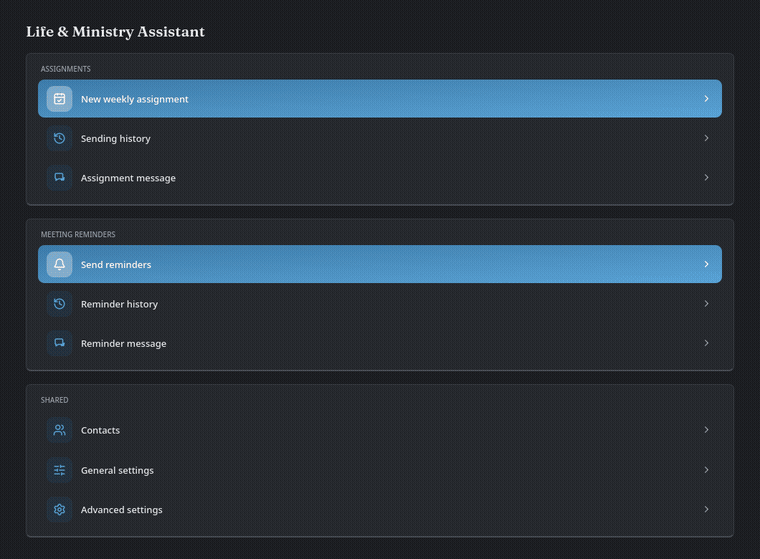
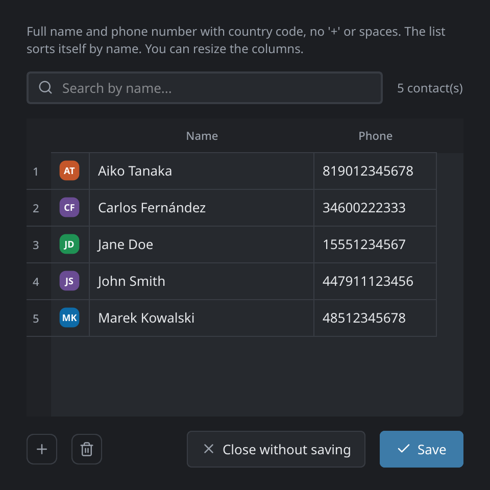
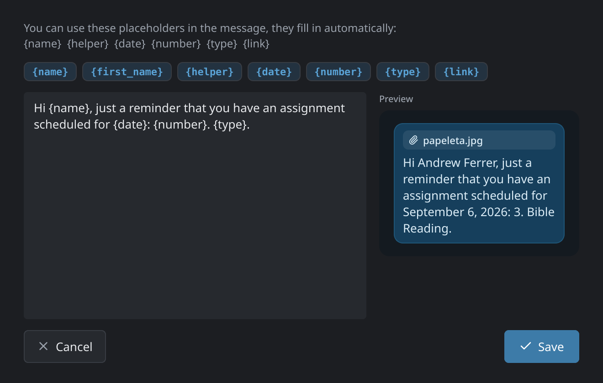
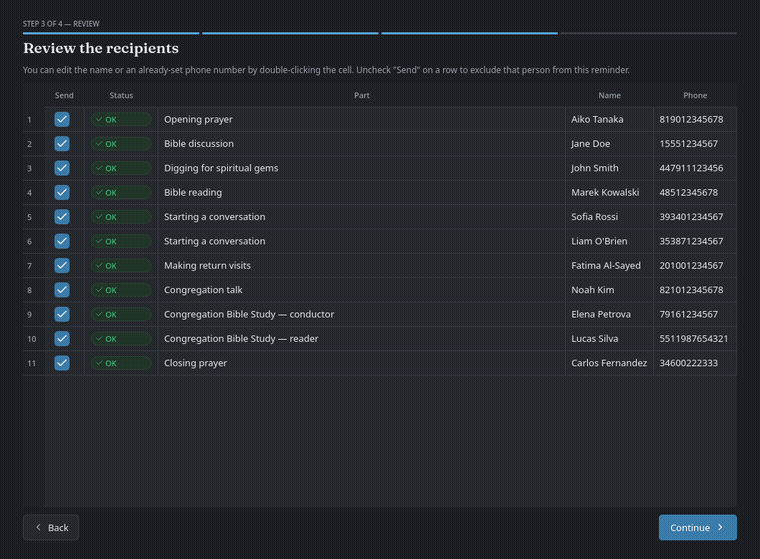

<p align="center">
  
</p>

<h1 align="center">Life & Ministry Assistant 🗓️</h1>

<p align="center">
  <strong>Turns the Life and Ministry Meeting Workbook into ready-to-send WhatsApp assignments — no Excel, no macros, no BulkPDF/Wine.</strong>
</p>

<p align="center">
  <a href="https://github.com/ncfer/life-ministry-assistant/releases/latest"></a>
  <a href="https://github.com/ncfer/life-ministry-assistant/actions/workflows/build.yml"></a>
  <a href="LICENSE"></a>
  
</p>

<p align="center">
  <a href="https://github.com/ncfer/life-ministry-assistant/releases/latest">⬇ Download</a> ·
  <a href="https://github.com/ncfer/life-ministry-assistant/issues/new?labels=bug">🐛 Report a bug</a> ·
  <a href="https://github.com/ncfer/life-ministry-assistant/issues/new?labels=enhancement">✨ Request a feature</a> ·
  <a href="README.es.md">🌐 Español</a>
</p>

---

<p align="center">
  
</p>

There are two ways to use it: with a **window** (built for anyone, no
computer skills needed) or from the **terminal** (faster once you're
used to it). Both do the same thing under the hood.

A couple more screens that aren't in the walkthrough above:

<table>
  <tr>
    <td width="50%">
      <br>
      <sub><strong>Contacts.</strong> Matched to each assignment automatically, with fuzzy-match suggestions.</sub>
    </td>
    <td width="50%">
      <br>
      <sub><strong>Message editor.</strong> Live preview of exactly what the recipient will get.</sub>
    </td>
  </tr>
</table>

---

## 🔄 How it works

<table>
  <tr>
    <td align="center" width="33%">
      <h2>📄 → 🗓️</h2>
      <strong>1. Bring in the workbook</strong><br>
      <sub>Local PDF, a Padlet board, or a Google Drive link</sub>
    </td>
    <td align="center" width="33%">
      <h2>🔍 → ✅</h2>
      <strong>2. Review & auto-match</strong><br>
      <sub>Names matched to phone numbers, edit whatever's missing</sub>
    </td>
    <td align="center" width="33%">
      <h2>💬 → 📤</h2>
      <strong>3. Send over WhatsApp</strong><br>
      <sub>Real Chrome window, one confirm click, nothing sends by surprise</sub>
    </td>
  </tr>
</table>

---

## ✨ Features

<table>
  <tr>
    <td width="50%" valign="top">
      <strong>📋 Assignment slips</strong><br>
      Generates the official S-89-style PDF/JPG slip for every
      assignment that has one, straight from the workbook PDF. No
      manual copy-pasting.
    </td>
    <td width="50%" valign="top">
      <strong>🔔 Calendar reminders</strong><br>
      Attaches a <code>.ics</code> file, a Google Calendar link, or
      both — lands straight on the person's phone calendar.
    </td>
  </tr>
  <tr>
    <td width="50%" valign="top">
      <strong>📣 Meeting reminders, beyond just the slip roles</strong><br>
      A separate flow that reminds <em>everyone</em> with a part that
      week (Bible reading, talks, prayers…), sending that week's
      program photo with a short personalized caption for each person.
    </td>
    <td width="50%" valign="top">
      <strong>🧠 Smart contact matching</strong><br>
      Looks up each person's phone number automatically; if it can't
      find an exact match it suggests the closest name instead of
      failing silently.
    </td>
  </tr>
  <tr>
    <td width="50%" valign="top">
      <strong>✏️ Editable message templates, live preview</strong><br>
      Change the wording without touching code. Placeholders like
      <code>{name}</code> or <code>{date}</code> fill themselves in, and
      you see exactly what gets sent before it's sent.
    </td>
    <td width="50%" valign="top">
      <strong>🕓 Send history</strong><br>
      Every batch you send (assignments and reminders) is logged, so
      you can check who got what and when.
    </td>
  </tr>
  <tr>
    <td width="50%" valign="top">
      <strong>🖥️ Two ways to use it</strong><br>
      A full windowed mode for anyone, or a scriptable terminal/CLI
      mode for advanced or batch use.
    </td>
    <td width="50%" valign="top">
      <strong>🌗 Switchable language & theme</strong><br>
      UI language and a light/dark theme, both changeable from
      Settings at any time.
    </td>
  </tr>
  <tr>
    <td width="50%" valign="top" colspan="2">
      <strong>🌍 Runs anywhere</strong><br>
      Linux, Windows and Mac, either as a single-file executable or
      straight from source.
    </td>
  </tr>
</table>

<p align="center">
  
</p>
<p align="center"><sub>The program photo above is a made-up example, not a real workbook page — see the note below.</sub></p>

> [!NOTE]
> This project isn't affiliated with or endorsed by Jehovah's Witnesses,
> the Watch Tower Bible and Tract Society, WhatsApp, or Meta Platforms,
> Inc. It's an independent tool that automates a real browser session
> over WhatsApp Web — the same as using it by hand, just scripted — and
> is built to help manage the S-89 assignment workflow.

## 📦 Installation (first time only)

No terminal or computer skills needed: unzip the folder wherever you
want, and open the `launcher` folder for your system's launcher — except
on Windows with a pre-built `.exe`, which sits at the top level instead
(see below):

- **Windows:** if `LifeMinistryAssistant.exe` exists at the top level of
  this folder, use it — it doesn't need Python installed (everything's
  bundled), it's about 150–200 MB, and it starts right up. If it doesn't
  exist, open `launcher/` and use `launch_gui.bat` instead (does the same
  thing, but needs Python installed and shows up as a console window).
  You can create a Desktop shortcut by right-clicking either one →
  "Create shortcut".
  (`LifeMinistryAssistant.exe` doesn't ship pre-built in the zip because of
  its size — whoever distributes the app can build it once by running
  `dev/build_exe.bat` on a real Windows machine, see the comment inside
  that file. `LifeMinistryAssistant.exe` doesn't download a browser on its own:
  if it can't find Chrome, Edge or Chromium installed when sending over
  WhatsApp, it tells you clearly what to install. `launch_gui.bat` still
  offers to download its own browser automatically the first time if
  needed, same as before.)

  > [!NOTE]
  > `LifeMinistryAssistant.exe` isn't code-signed yet, so Windows
  > SmartScreen may show "Windows protected your PC" the first time you
  > run it. Click **More info**, then **Run anyway**. A free code-signing
  > certificate from [SignPath Foundation](https://signpath.org/) is in
  > progress, which will remove this warning once approved.
- **Mac:** open `launcher/` and double-click `launch_gui.command` (don't
  use `launch_gui.sh` for double-clicking — Mac would open it as a text
  file instead of running it). The first time, Mac may warn that it's
  from "an unidentified developer" — right-click the file → **Open**, and
  confirm the prompt (only needed that one time).
- **Linux:** open `launcher/` and double-click `launch_gui.sh` (if your
  file manager asks what to do, choose "Run" or "Run in terminal"), or
  from a terminal: `./launcher/launch_gui.sh`.

The first time you open it, everything installs itself — the Python
environment, all dependencies, and the browser for WhatsApp if needed —
so it takes a few minutes and needs an internet connection; leave the
window open until it finishes. After that, it opens instantly.

You only need **Python 3** installed beforehand (if you don't have it,
the launcher itself tells you with a download link —
[python.org/downloads](https://www.python.org/downloads/); on Windows,
check the "Add python.exe to PATH" box during installation) and, if you
want to send over WhatsApp using your own Chrome instead of a downloaded
one, **Google Chrome** already installed — if you don't have it, the
launcher downloads its own browser automatically, no action needed.

## 🖱️ Windowed mode (recommended)

> [!IMPORTANT]
> The S-89 assignment template PDF isn't included (it's Watch Tower's
> own form) — ask whoever gave you this folder for it, or use the one
> your congregation already has.

The first time, it'll ask you to set up the paths (where that template
is, where to save generated files, etc.) — done once from the window
itself, no files to touch by hand.

After that, each week you just need to:
1. **New weekly assignment** → pick the workbook PDF.
2. Check the week (or weeks) you want to generate.
3. Review the table: if someone's phone number wasn't found, it shows
   up highlighted in red with a suggestion button if there's a similar
   name in the list, or you can type it in by hand.
4. Preview each slip before continuing.
5. Choose whether to send a `.ics` file, a Google Calendar link, or
   both, check "I've reviewed this" and hit SEND.

**Send reminders** works the same way but covers everyone with a part
that week, not just the roles that get an official slip: pick the
workbook, review the table (same phone-number matching and preview),
and it sends that week's program photo with a personalized caption to
each participant — no `.ics`/calendar step here, since it's a quick
heads-up rather than a formal assignment.

From the home screen you can also edit contacts, the assignment and
reminder messages, and advanced settings (language, theme, WhatsApp
timing between sends) — all through forms, no files or commands.

## ⌨️ Terminal mode (advanced)

### 1. Editing the contact list

Contacts live in `contacts.csv`, a plain text file with two columns:
`name` and `phone`. Two ways to edit it, pick whichever's more
comfortable:

- **With a spreadsheet:** open `contacts.csv` with LibreOffice Calc,
  Excel or Google Sheets, edit it like a normal table, and save (keep
  the CSV format when saving).
- **With the terminal menu**, without touching any file by hand:
  ```bash
  python -m assistant.edit_contacts
  ```
  Lets you list, search, add/update and delete contacts through a
  numbered menu.

The phone number goes with the country code and no spaces, `+`, or
other symbols — e.g. a US number would be `15551234567`, a UK number
`447911123456`.

If you're coming from the old Excel file and want to bring over the
whole list at once:
```bash
python -m assistant.migrate_contacts "Assignment Template.xlsm" contacts.csv
```

### 2. Editing the WhatsApp message

The text that gets sent lives in `message.txt`, in plain language, no
code involved. You can change it however you like; the placeholders in
curly braces get filled in automatically with each assignment's data:

| Placeholder | Filled with |
|---|---|
| `{name}` | Person's full name |
| `{first_name}` | Person's first name only |
| `{helper}` | Helper's name (empty if none) |
| `{date}` | Meeting date |
| `{number}` | Assignment number |
| `{type}` | Assignment type (e.g. "Bible Reading") |
| `{link}` | Google Calendar link (if you choose to send it) |

Default example:
```
Hi {first_name}, just a reminder that you have an assignment coming up on {date}. You can add it to your calendar using the link or the file below. Thanks!

{link}
```

### 3. Generating the slips

```bash
python -m assistant.cli \
  --workbook "Meeting Workbook 09-10 2026.pdf" \
  --template "Assignment Template.pdf" \
  --month 2026-09
```

This generates a PDF, a JPG and a `.ics` file per person inside
`output/`, and prints a summary showing the phone number found for
each one (or a warning if none was found, to review by hand). Nothing
gets sent yet.

For a single week instead of a whole month:
```bash
--weeks 2026-09-09,2026-09-16
```

### 4. Sending over WhatsApp

Add `--send` to the same command. Before sending anything:
1. It asks whether you want to send the reminder as an `.ics` file, as
   a Google Calendar link, or both (or pass it directly with
   `--reminder ics|gcal|both`).
2. It shows you the summary and asks you to confirm by typing `y`.

The first time, a Chrome window will open with a QR code — scan it with
your phone (WhatsApp > Settings > Linked Devices) and you won't need to
do it again on future runs (the session is saved on your own computer).

> [!NOTE]
> **Is it safe?** There's no absolute guarantee, but the risk is low: it
> sends to known contacts (not strangers or large lists), and it works by
> controlling a real browser over WhatsApp Web — as if you were doing it
> by hand, just automated — instead of using some unofficial library that
> talks directly to WhatsApp. It also keeps pauses between messages so it
> doesn't look like a mass send.

## 🗂️ Output structure

```
output/
└── 2026-09/
    ├── 2026-09-09 - 3 - Jane Doe.pdf
    ├── 2026-09-09 - 3 - Jane Doe.jpg
    ├── 2026-09-09 - 3 - Jane Doe.ics
    └── ...
```

## 🤝 Sharing this app with someone else or another congregation

Run `./dev/package.sh` (from a terminal, in your working copy) to generate
`dist/life-ministry-assistant-YYYYMMDD.zip`: a clean copy of the
project, without your contacts, your send history, your configuration,
any workbooks you've used, or your own customized message wording —
just the code and a sample `contacts.csv`. Share it as-is; whoever receives it just needs to
unzip it and follow the "Installation" section above. If you change
something in the code later, run `./dev/package.sh` again to generate an
updated zip — no extra steps per operating system, it's the same
folder for Windows, Mac and Linux.

---

<p align="center"><sub>MIT licensed — see <a href="LICENSE">LICENSE</a>.</sub></p>
